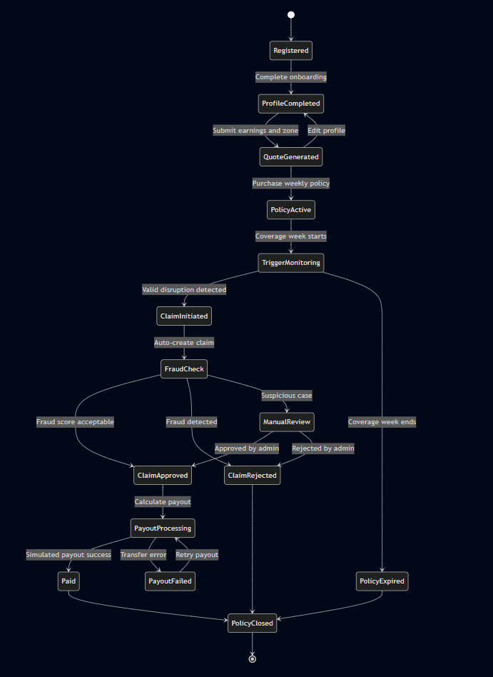
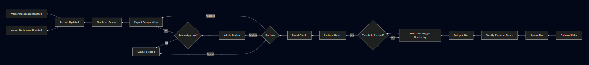
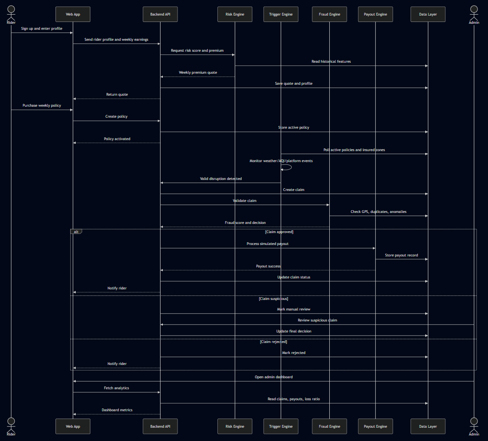
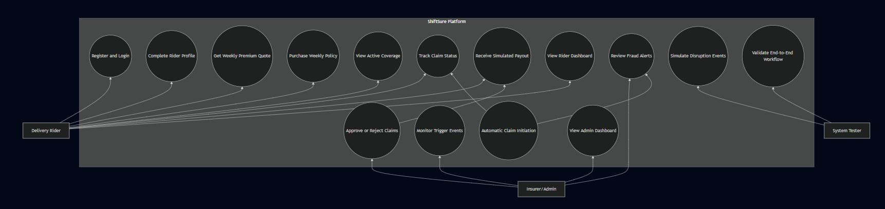
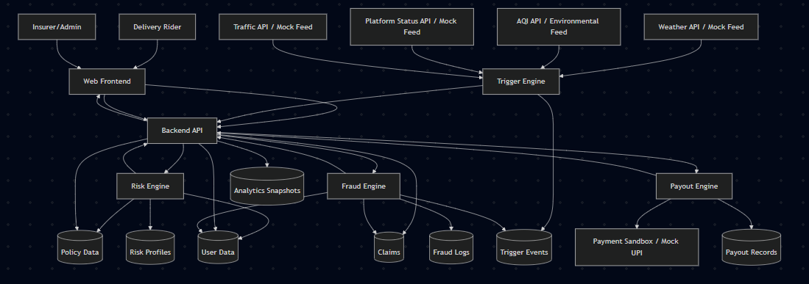
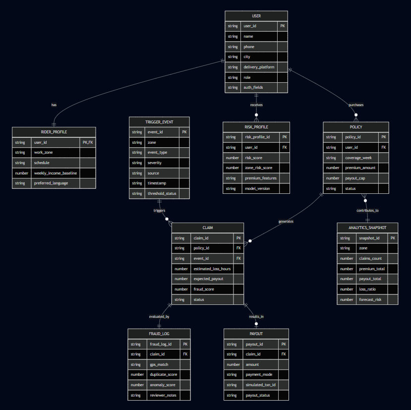
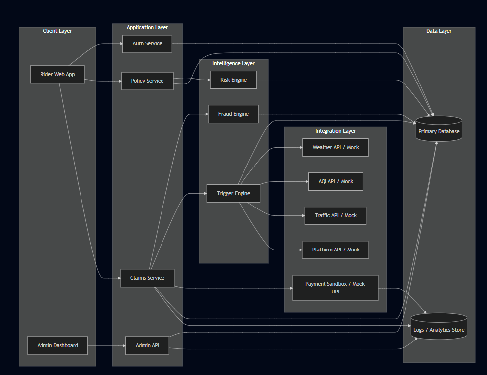

# ShiftSure: AI-Powered Insurance for India’s Gig Economy 🚀🛵

Project Synopsis: AI-Powered Insurance for India’s Gig Economy  
A parametric insurance platform that protects platform-based delivery workers against income loss caused by external disruptions such as heavy rain, extreme heat, severe pollution, curfews, and sudden zone closures. This directly matches the challenge brief, which asks teams to build an AI-enabled parametric insurance platform for delivery partners with automated coverage, payouts, fraud detection, and weekly pricing.  

***

## 0. Cover 🧾✨

- 📛 Project Title: ShiftSure: AI-Powered Insurance for India’s Gig Economy  
- 👥 Team Name: AI Avengers  
- 🧮 Version: v0.1  
- 📅 Date: 20 March, 2026  

**Revision History:**

| Version | Date            | Author        | Change                                      |
|--------|-----------------|---------------|---------------------------------------------|
| v0.1   | 20 March, 2026  | Saksham Gupta | Initial Draft                               |
| v0.5   | 4 April, 2026   | AI Avengers   | Core workflow and automation completed      |
| v1.0   | 17 April, 2026  | AI Avengers   | Final submission package completed          |

***

## 1. Overview 🌍🧠

- 🌀 Problem Statement: India’s platform-based delivery partners regularly lose income when external disruptions such as heavy rain, floods, heatwaves, severe pollution, curfews, strikes, or sudden local closures reduce or stop their working hours. The project brief states that these workers can lose around 20–30% of their monthly earnings and currently have no meaningful income-protection safety net for such uncontrollable events.  
- 🎯 Goal: Develop an AI-enabled parametric insurance platform that protects gig delivery workers from loss of income caused by external disruptions, using weekly policy pricing, automated disruption-triggered claims, fraud detection, and simulated instant payouts. This is the exact challenge defined in the use-case document.  
- 🚫 Non-Goals: Health insurance, life insurance, accident coverage, vehicle repair reimbursement, and any payout for damage to external assets are excluded, because the brief explicitly restricts coverage to loss of income only.  
- 💡 Value Proposition: The system gives delivery workers a simple weekly financial safety net that activates when measurable real-world disruptions reduce their ability to work. It also helps insurers by using AI for risk scoring and fraud reduction, while using parametric automation to create a low-friction claims experience.  

***

## 2. Scope and Control 🎯📋

### 2.1 In-Scope ✅📌

- 💻 Web-first onboarding for a chosen delivery persona, such as grocery or quick-commerce delivery workers.  
- 📆 Weekly policy creation and renewal.  
- 🤖 AI-based risk assessment and dynamic premium calculation.  
- 🌧️ Parametric trigger detection using weather, AQI, zone closure, traffic, or platform-status signals.  
- ⚙️ Automatic claim initiation for valid disruption events.  
- 🕵️ Fraud checks including anomaly detection, location validation, and duplicate claim prevention.  
- 💸 Simulated instant payout workflow.  
- 📊 Rider dashboard and insurer/admin dashboard.  

### 2.2 Out-of-Scope ⛔🚫

- 🩺 Health, life, accident, or vehicle repair insurance.  
- 🏦 Real insurer underwriting integration in production.  
- 💳 Real banking or UPI settlement in live mode.  
- 🇮🇳 National-scale deployment across all gig platforms in the prototype phase.  
- 📜 Full legal insurance compliance workflow for a commercial launch.  

### 2.3 Assumptions 🧩

- 🌐 Public or mock APIs can be used for weather, traffic, platform, and payment data, because the brief allows free tiers, mocks, sandbox, and simulated integrations.  
- 📍 Riders consent to location/activity verification during active policy windows.  
- 🧪 Historical disruption and income datasets will be partly synthetic or mock if complete real data is unavailable.  
- 🧪 The project will be built as a working prototype for academic and judging purposes.  

### 2.4 Constraints 📏

- 📉 Coverage must remain strictly limited to income loss only.  
- 📆 Premiums must be structured on a weekly basis.  
- 🎭 The team must choose one delivery-worker sub-category and build specifically for that persona.  
- 🕕 The final system should show AI/ML use, automated claims logic, fraud prevention, payouts, and dashboards within the six-week project journey.  

### 2.5 Dependencies 🔗🧱

- 🌦️ Weather APIs or mock weather feeds.  
- 🌫️ AQI / environmental data feed or mock environmental feed.  
- 🚦 Mock traffic and delivery-platform availability APIs.  
- 💳 Payment sandbox or mock payout simulator such as Razorpay test mode, Stripe sandbox, or UPI simulator.  
- ☁️ Cloud hosting, database access, and version control.  

### 2.6 Acceptance Criteria (Signoff Scenarios) ✅🧪

- 🧾 WEEKLY POLICY CREATION: GIVEN a registered delivery worker, WHEN weekly income and work-zone data are entered, THEN the system generates a weekly premium quote and policy option.  
- 🌩️ PARAMETRIC TRIGGERING: GIVEN an active policy and a valid disruption event in the insured zone, WHEN trigger thresholds are crossed, THEN the system automatically initiates a claim.  
- 🛡️ FRAUD CONTROL: GIVEN a triggered claim, WHEN the system detects GPS inconsistency, duplicate request patterns, or implausible activity, THEN it flags the claim for review or rejection.  
- 💰 PAYOUT PROCESSING: GIVEN an approved claim, WHEN payout logic runs, THEN the system processes a simulated transfer of lost wages.  
- 📊 DASHBOARD VISIBILITY: GIVEN active usage, WHEN a worker or admin opens the dashboard, THEN relevant metrics such as active weekly coverage, earnings protected, claims volume, and risk hotspots are visible.  

***

## 3. Stakeholders and RACI 👥📌

Stakeholders: AI Avengers team members, project mentor, university department, judges, participating delivery-worker persona, and insurer/admin-side evaluators. The template synopsis includes a Stakeholders and RACI section, so this structure follows that format.  

**RACI Matrix:**

| Activity                          | Responsible (R)                          | Accountable (A)   | Consulted (C)        | Informed (I) |
|----------------------------------|------------------------------------------|-------------------|----------------------|-------------|
| Requirements and Planning        | Saksham Gupta                            | Saksham Gupta     | Mentor               | Team        |
| System architecture and workflow design | Saksham Gupta, Rachit Gupta          | Saksham Gupta     | Mentor               | Team        |
| Frontend development             | Rachit Gupta, Gautam Sourat              | Saksham Gupta     | Team                 | Mentor      |
| Backend and database             | Saksham Gupta, Gautam Sourat             | Saksham Gupta     | Rachit Gupta         | Team        |
| AI premium model                 | Shubhansh Gupta                          | Shubhansh Gupta   | Manas Kashyap, Mentor | Team      |
| Fraud detection model            | Manas Kashyap                            | Manas Kashyap     | Shubhansh Gupta, Mentor | Team    |
| Integration and testing          | Gautam Sourat, Rachit Gupta              | Saksham Gupta     | Team                 | Mentor      |
| Documentation and demo prep      | Team                                     | Saksham Gupta     | Mentor               | University  |
| Final review and submission      | Team                                     | AI Avengers       | Mentor               | Mentor      |

***

## 4. Team and Roles 🧑‍💻👨‍💻

| Member        | Role                      | Responsibilities                                                                                                                                 | Key Skills                                                                 | Availability (hr/week) | Contact         |
|--------------|---------------------------|--------------------------------------------------------------------------------------------------------------------------------------------------|---------------------------------------------------------------------------|------------------------|-----------------|
| 🧑‍💻 Saksham Gupta | Team Lead, Full Stack Developer | Overall project coordination, backend architecture, API development, deployment, integration review, and final technical validation.            | Full stack development, APIs, system design, deployment, databases       | 15                     | navyuktsa ksham@ gmail.co m |
| 🤖 Shubhansh Gupta | AI/ML Engineer         | Dynamic premium model design, predictive risk modelling, training workflows, and tuning of AI-based weekly pricing logic.                       | Python, machine learning, pandas, scikit-learn / TensorFlow, data analysis, model evaluation | 15 | shubhan shgupta2 564108@ gmail.co m |
| 🤖 Rachit Gupta | AI/ML Engineer            | Data preprocessing, feature engineering, premium prediction support, risk-scoring model development, model evaluation, and analytics support for pricing and claim intelligence. | Python, ML, predictive modelling, feature engineering, analytics         | 15                     | guptarac hit085@g mail.com |
| 🛡️ Manas Kashyap | AI/ML Engineer           | Fraud detection, anomaly scoring, duplicate-claim detection, location/activity validation logic, and suspicious claim analysis.                  | Python, anomaly detection, fraud analytics, ML, validation logic          | 15                     | manaska shyap25 64108@g mail.com |
| 🧑‍💻 Gautam Sourat | Full Stack Developer     | Frontend implementation, authentication, policy and claims modules, admin dashboard, payout integration, and database operations.              | React / Next.js, Node.js / FastAPI, MongoDB / SQL, backend integration, dashboard development | 15 | gautams atya2005 @gmail.c om |

***

## 5. Weekwise Plan and Assignments 🗓️📆

- 📍 Week 1 (March 4 – March 10): Requirement analysis, delivery-persona selection, trigger ideation, business flow mapping. Deliverables: detailed requirement notes, initial wireframes, architecture sketch.  
- 🧾 Week 2 (March 11 – March 20): README idea document, workflow finalization, weekly premium logic, AI plan, prototype screens, Phase 1 video. The brief explicitly requires the Phase 1 README to explain persona scenarios, application workflow, weekly premium model, parametric triggers, web/mobile choice, AI/ML integration, tech stack, and development plan.  
- 🧑‍💻 Week 3 (March 21 – March 27): Registration flow, login, rider profile, policy creation module, base database schema.  
- ⚙️ Week 4 (March 28 – April 4): Dynamic premium engine, claims module, 3–5 automated triggers, Phase 2 demo. The brief specifically asks Phase 2 submissions to showcase registration, policy management, dynamic premium calculation, and claims management.  
- 🕵️ Week 5 (April 5 – April 11): Fraud detection pipeline, GPS/activity validation, duplicate-claim logic, payout simulator.  
- 📊 Week 6 (April 12 – April 17): Worker dashboard, insurer dashboard, final system integration, pitch deck, final 5-minute demo. The brief requires advanced fraud detection, simulated instant payouts, intelligent dashboards, and a final demo that shows a disruption triggering automated AI claim approval and payout.  

***

## 6. Usera and UX 🎨📱

### 6.1 Personas

- 👷 Delivery Worker: A grocery / quick-commerce rider who depends on daily or weekly earnings and needs simple income protection against disruption.  
- 🧑‍💼 Insurer/Admin: A platform operator or insurance-side reviewer who monitors risk, claims, fraud alerts, and portfolio performance.  
- 🧪 System Tester / Internal Operator: Team member or evaluator who runs simulated scenarios, triggers events, and validates workflows.  

### 6.2 Top User Journeys

- 🧾 Rider Onboarding Journey: A rider signs up, selects work zones and work schedule, enters weekly earning baseline, receives a risk-based quote, and activates a weekly policy.  
- 🌩️ Disruption-to-Payout Journey: A disruption occurs in the rider’s zone, the trigger engine detects it, a claim is auto-created, fraud checks run, the payout is approved, and the simulated transfer is completed.  
- 📊 Admin Monitoring Journey: The admin sees active policies, high-risk zones, fraud alerts, and next-week disruption predictions.  

### 6.3 User Stories

- 🧑‍🦱 “As a delivery rider, I want my weekly policy to automatically protect my income during severe weather, so I do not lose my earnings without support.”  
- 🧾 “As a rider, I want a zero-touch claim experience, so I do not have to manually submit complicated paperwork.”  
- 🛡️ “As an insurer/admin, I want fraud alerts based on location and activity mismatch, so that invalid claims can be prevented.”  
- 📈 “As an admin, I want predictive analytics for next week’s likely disruption claims, so that I can understand portfolio risk.”  

***

## 7. Market and Competitors 📈🏦

### 7.1 Competitors

- 🏢 Traditional insurance products that focus on life, accident, or vehicle coverage rather than income-loss parametric protection.  
- 🧑‍💼 Gig-platform support programs that may offer ad hoc assistance but not automated weekly parametric insurance.  
- 🌦️ Generic weather insurance models that are not tailored to hyperlocal delivery-worker income disruption.  

### 7.2 Positioning

ShiftSure is differentiated by focusing only on measurable loss-of-income events for a selected delivery-worker segment, rather than offering general insurance. This fits the brief’s insistence on a persona-focused, weekly-priced, AI-enabled, parametric platform with fraud detection and automated payout flow.  

***

## 8. Objectives and Success Metrics 🎯📊

- O1: Weekly Quote Generation Accuracy:  
  🎯 Target that all valid rider profiles receive a weekly premium quote successfully.  
  📈 KPI: quote success rate.  

- O2: Trigger Detection Reliability:  
  🎯 Target that simulated disruption events are detected with high precision.  
  📈 KPI: valid trigger detection rate.  

- O3: Claim Automation Speed:  
  🎯 Target claim initiation within seconds after a valid trigger event.  
  📈 KPI: average trigger-to-claim time.  

- O4: Fraud Detection Effectiveness:  
  🎯 Target detection of GPS spoofing, duplicate claims, and suspicious activity patterns.  
  📈 KPI: fraud flag precision/recall.  

- O5: Payout Processing Success:  
  🎯 Target successful simulated transfer for all approved claims.  
  📈 KPI: approved-claim payout success rate.  

- O6: Dashboard Usefulness:  
  🎯 Target accurate display of worker and insurer metrics.  
  📈 KPI: dashboard correctness and latency.  

***

## 9. Key Features ⭐🚀

- 🤖 AI-Powered Risk Assessment (Must): Dynamic weekly premium calculation based on rider location, disruption exposure, and earning pattern. The brief lists dynamic weekly pricing and predictive risk modelling as mandatory AI features.  
- 🛡️ Intelligent Fraud Detection (Must): Anomaly detection, location validation, activity validation, and duplicate claim prevention. These are explicitly named in the brief.  
- ⚙️ Parametric Automation (Must): Real-time trigger monitoring, automatic claim initiation, and instant payout workflow. These are also explicitly listed as required capabilities.  
- 🔌 Integration Layer (Must): Weather APIs, traffic data, platform data, and payment system integration, using mocks or sandbox tools where needed. The brief explicitly permits free tiers, mocks, and sandbox integrations.  
- 📲 Rider Dashboard (Should): Active weekly coverage, claims history, and protected earnings.  
- 🧮 Admin Dashboard (Should): Loss ratios, fraud alerts, disruption heatmaps, and next-week predictive analytics, because the final phase expects dashboards for workers and insurers with these kinds of metrics.  

***

## 10. Architecture 🏗️🧬

- 🖥️ Frontend Layer: Web application for rider onboarding, quote generation, policy purchase, claim status, payout history, and dashboards.  
- 🧩 Backend API Layer: Auth, rider profile management, policy engine, claims engine, payout orchestrator, admin APIs.  
- 🤖 Risk Engine: ML service for weekly premium calculation and risk scoring.  
- 🌩️ Trigger Engine: Polls weather, AQI, traffic, and mock platform-status feeds to identify qualifying disruption events.  
- 🛡️ Fraud Engine: Validates rider location, timing, event relevance, duplicate claims, and anomaly patterns.  
- 💸 Payout Engine: Simulated transfer processing through sandbox/mock payment flow.  
- 🗄️ Data Layer: Stores users, policies, claims, triggers, payouts, logs, and analytics.  
- 🔄 Example workflow: Rider buys weekly coverage → trigger engine monitors insured zone → disruption threshold is crossed → claim is auto-created → fraud score is computed → approved claim amount is calculated based on lost income → payout simulator processes transfer → worker and admin dashboards update. This workflow directly reflects the use-case document’s expected end-to-end platform behaviour.

***

## 11. Data Design 💾📚

- **User:** user_id, name, phone, city, delivery_platform, role, auth_fields  
- **RiderProfile:** user_id, work_zone, schedule, weekly_income_baseline, preferred_language  
- **Policy:** policy_id, user_id, coverage_week, premium_amount, payout_cap, status  
- **RiskProfile:** user_id, risk_score, zone_risk_score, premium_features, model_version  
- **TriggerEvent:** event_id, zone, event_type, severity, source, timestamp, threshold_status  
- **Claim:** claim_id, policy_id, event_id, estimated_loss_hours, expected_payout, fraud_score, status  
- **FraudLog:** claim_id, gps_match, duplicate_score, anomaly_score, reviewer_notes  

- **Payout:** payout_id, claim_id, amount, payment_mode, simulated_txn_id, payout_status  
- **AnalyticsSnapshot:** zone, claims_count, premium_total, payout_total, loss_ratio, forecast_risk  

***

## 12. Technical Workflow Diagrams 📊🧩

### 12.1 State Transition Diagram

### 12.2 Sequence Diagram

### 12.3 Use Case Diagram

### 12.4 Data Flow Diagram

### 12.5 ER Diagram

### 12.6 Technical Workflow Diagram

### 12.7 Work Architecture Diagram

...

***

## 13. Quality (Non-Functional Requirements and Testing) ✅🧪

### 13.1 Non-Functional Requirements

| Metric              | SLI / Target                                  | Measurement                     |
|---------------------|-----------------------------------------------|---------------------------------|
| 📶 Availability        | 99% uptime during demo and staging use        | Uptime monitoring               |
| ⚡ Quote latency       | Quote response within 3 seconds               | API timing logs                 |
| ⏱️ Trigger latency     | Detection to claim initiation within 10 seconds | Event timestamps             |
| 🔄 Dashboard freshness | Updates within 5 seconds for simulated events | Frontend/backend logs          |
| 🧱 Reliability         | No critical crash in end-to-end demo          | Test checklist                  |
| 🔐 Security            | Authenticated access for rider and admin modules | Access logs                  |
| 📝 Logging integrity   | 100% retention of claim and payout events during demo | Log audit                 |

### 13.2 Test Plan

- 🧪 Unit Tests: Pricing formula, premium API, fraud-score computation, payout calculation.  
- 🔗 Integration Tests: Onboarding to policy creation, trigger detection to claim creation, fraud module to admin review, payout completion.  
- 🔁 End-to-End Tests: Full flow from registration to simulated payout.  
- 🚀 Performance Tests: Concurrent trigger events and dashboard loading.  
- 🛡️ Security Tests: Auth validation, role-based access, duplicate claim attempts.  

### 13.3 Environments

- 💻 Development: Local systems with mocked APIs.  
- ☁️ Staging: Shared cloud deployment for integration testing.  
- 🎬 Demo/Production-like: Final hosted version with seeded demo accounts and controlled trigger simulation.  

***

## 14. Security and Compliance 🔐🛡️

### 14.1 Threat Model

| Asset               | Threat                        | STRIDE                    | Mitigation                                   | Owner   |
|---------------------|-------------------------------|---------------------------|----------------------------------------------|--------|
| Claim flow          | Fake event-based claims       | Spoofing                  | Validate trigger source and timestamp        | Manas  |
| Rider location data | GPS spoofing                  | Spoofing/Tampering        | Activity and geofence validation             | Manas  |
| Payout process      | Duplicate payout request      | Tampering/Repudiation     | Idempotent payout logic, claim locking       | Gautam |
| Admin panel         | Unauthorized access           | Elevation of Privilege    | JWT auth and role-based access               | Saksham |
| Policy pricing      | Manipulated premium requests  | Tampering                 | Server-side pricing validation               | Shubhansh |

### 14.2 AuthN / AuthZ

- 🔐 Rider login and admin login will use secure authentication.  
- 🧑‍💼 Admin-only routes will be protected with role-based authorization.  
- ⚠️ Sensitive actions like claim override and payout retry will be restricted.  

### 14.3 Audit and Logging

- 🧾 All quotes, policy activations, trigger events, fraud decisions, and payouts will be logged.  
- 🕒 Logs will include timestamps, user IDs, event IDs, and model version identifiers.  
- 📚 Demo logs will be retained for review and judging.  

### 14.4 Compliance

This is an academic prototype, but the system design still respects minimal privacy, secure access, and auditability. The project brief itself focuses on product capability and judging deliverables rather than live commercial deployment compliance.  

***

## 15. Delivery and Operations 🚚⚙️

### 15.1 Release Plan

- 🧪 Alpha: End of Week 2 — idea document, wireframes, architecture, quote prototype.  
- 🧪 Beta: End of Week 4 — registration, policies, dynamic premium, claims flow.  
- 🚀 v1.0 Final: End of Week 6 — fraud detection, payouts, dashboards, final demo package.  

### 15.2 CI/CD and Rollback

- 🧬 GitHub repository with main and feature branches.  
- 🤖 GitHub Actions for linting, tests, and deployment.  
- 🔁 Rollback through version tags and previous successful builds.  

### 15.3 Monitoring and Alerting

- ❤️ API health checks.  
- 📉 Logging for trigger failures, payout failures, and fraud-engine errors.  
- 🚨 Manual alerting for demo-stage critical issues.  

### 15.4 Communication Plan

- 🗣️ Monday/Wednesday/Friday stand-ups.  
- 📧 Weekly mentor update.  
- 🎥 End-of-phase demo reviews.  

***

## 16. Risks and Mitigations ⚠️🛡️

- 📊 Insufficient real-world data: Use public datasets plus synthetic/mock data for training and simulation.  
- 🌐 API instability: Use cached responses and fallback mock services, which the brief explicitly permits.  
- 🧪 Fraud model false positives: Keep threshold-based fallback logic and admin review path.  
- 🧱 Scope overload: Prioritize core must-have features first, because the brief clearly defines required deliverables for each phase.  
- ⏰ Time pressure: Build web-first, use mock integrations, and avoid unnecessary mobile complexity unless specifically justified.  

***

## 17. Evaluation Strategy and Success Metrics 📏📈

- 🔁 Baseline comparison: Compare manual claim workflow versus parametric auto-claim workflow for speed and consistency.  
- 🌧️ Scenario testing: Run heavy-rain, AQI-spike, zone-closure, and curfew simulations.  
- 🕵️ Fraud scenarios: Test duplicate claim attempts, GPS spoofing, and claims outside insured zone/time.  
- 📊 Portfolio analytics: Track premium collected, payouts triggered, claim frequency, fraud flags, and zone-level loss ratio.  
- 🏆 Success benchmark: The final demo should visibly show disruption detection, automatic claim initiation, fraud screening, approval logic, payout simulation, and dashboard update, because the brief explicitly requires this kind of end-to-end demonstration in the final submission.  

***

## 18. Appendices 📚🧾

### 18.1 Glossary

- 📘 Parametric Insurance: Insurance where payout is triggered by predefined measurable events rather than manual damage assessment.  
- 💵 Weekly Premium: Insurance price charged for one week of coverage, which is mandatory in this project.  
- 🌩️ Trigger Event: External disruption crossing a defined threshold, such as heavy rain or severe AQI.  
- 🧮 Fraud Score: Model-based risk score for suspicious claims.  
- 📉 Loss Ratio: Total payout divided by total premium earned.  
- 🧠 Risk Profiling: AI/ML-based estimation of rider exposure to disruption risk.  

### 18.2 References

- 📄 Guidewire DEVTrails 2026 Use Case Document.  
- 🌐 Weather API documentation, AQI API documentation, and payment sandbox documentation to be cited in the final report where used.
